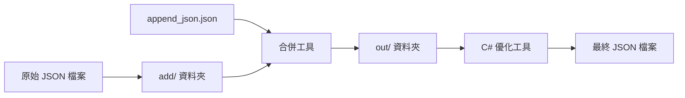

# FormDetails Tool

一個專為 C# FormDetail 類別結構設計的 JSON 檔案處理工具集，提供合併和優化功能。

## 📁 專案結構

```
FormDetails_tool/
├── add/                           # 輸入資料夾 - 放置需要處理的原始JSON檔案
│   └── *.json
├── out/                           # 輸出資料夾 - 存放處理後的JSON檔案
│   └── *.json
├── tests/                         # 測試檔案
│   ├── __init__.py
│   └── test_merge_json.py
├── append_json.json               # 要合併的JSON資料
├── merge_json.py                  # JSON合併腳本
├── optimized_process_json.py      # C#類別結構優化腳本
├── pyproject.toml                 # 專案設定檔
├── requirements-dev.txt            # 開發依賴
├── Makefile                       # 建置腳本
└── README.md                      # 說明文件
```

## 🚀 核心功能

### 📋 JSON 合併工具 (`merge_json.py`)

將 `append_json.json` 中的表單欄位自動合併到 `add/` 資料夾中所有 JSON 檔案的 `formFields` 陣列。

**✨ 特色功能：**

- 🔍 自動掃描並處理多個 JSON 檔案
- 🔗 智能合併 formFields 資料
- 📁 自動建立輸出資料夾
- 📝 詳細的處理日誌記錄

**🚀 快速開始：**

```bash
python merge_json.py
```

### ⚡ C# 結構優化工具 (`optimized_process_json.py`)

針對 C# FormDetail 類別結構進行 JSON 資料優化，確保與 .NET 序列化完全相容。

**✨ 特色功能：**

- 🎯 確保 JSON 結構符合 C# 類別定義
- 🧹 自動移除空值欄位，避免序列化錯誤
- 🔧 處理擴展資料（ExtensionData）
- ✅ 資料類型一致性檢查
- 📊 支援複雜的表單結構處理

**🚀 快速開始：**

```bash
python optimized_process_json.py
```

## 🏗️ 支援的 C# 類別結構

本工具完全支援以下 C# 類別結構，確保 JSON 序列化/反序列化的相容性：

```csharp
public class FormDetail
{
    public List<Form> Forms { get; set; }
}

public class Form
{
    public string FormId { get; set; }
    public string FormName { get; set; }
    public string Description { get; set; }
    public List<FormField> FormFields { get; set; }
    public List<FieldGroup> FieldGroups { get; set; }
}

public class FormField
{
    public string FormFieldId { get; set; }
    public string FieldName { get; set; }
    public string FieldType { get; set; }
    public JsonElement DefaultValue { get; set; }
    public bool IsReadonly { get; set; }
    public bool IsVisible { get; set; }
    public RelatedSource? RelatedSource { get; set; }
    public List<FieldOptions>? FieldOptions { get; set; }
    public string? FieldGroup { get; set; }
    public string? ParentField { get; set; }
    public JsonElement DisplayCondition { get; set; }
    public bool InfoDisplayCondition { get; set; }
    public string? RelatedFormsExtend { get; set; }
    public Guid? FlowNodeCode { get; set; }
    public int Sort { get; set; }
    public string SpecialFieldCode { get; set; }

    // 用於存儲未知屬性的字典
    [JsonExtensionData] public Dictionary<string, JsonElement>? ExtensionData { get; set; }
}
```

**🔧 處理特性：**

- ✅ 支援可空類型 (`?`) 的自動處理
- ✅ 支援 `JsonElement` 類型的動態資料
- ✅ 支援 `JsonExtensionData` 擴展資料
- ✅ 自動處理陣列和集合類型

## 📋 使用指南

### 🔄 工作流程概覽



### 📝 步驟一：JSON 合併

1. **📁 準備資料**

   ```bash
   # 將需要處理的 JSON 檔案放入 add/ 資料夾
   cp your_form.json add/

   # 準備要合併的 formFields 資料
   echo '{"fieldName": "新欄位", "fieldType": "dxTextBox"}' > append_json.json
   ```

2. **🚀 執行合併**

   ```bash
   python merge_json.py
   ```

3. **✅ 檢查結果**
   - 處理後的檔案會出現在 `out/` 資料夾中
   - 檔案名稱保持不變
   - 查看 `merge_json.log` 了解處理詳情

### ⚡ 步驟二：C# 結構優化

1. **🎯 執行優化處理**

   ```bash
   python optimized_process_json.py
   ```

2. **🔍 驗證結果**
   - 檢查 `out/` 資料夾中的檔案是否符合 C# 類別結構
   - 確保可以正常進行 `JsonSerializer.Deserialize<FormDetail>()`
   - 查看 `process_json.log` 了解處理詳情

### 🔧 進階使用

**批次處理多個檔案：**

```bash
# 一次處理多個 JSON 檔案
cp *.json add/
python merge_json.py
python optimized_process_json.py
```

**使用 Makefile 快速操作：**

```bash
make process-all    # 執行完整處理流程
make clean         # 清理輸出檔案
make test          # 執行測試
```

## 📊 實際範例

### 📥 輸入資料

**原始表單檔案** (`add/削價單.json`):

```json
{
  "forms": [
    {
      "formFields": [
        {
          "fieldName": "emp",
          "fieldType": "dxTextBox",
          "isReadonly": true,
          "isVisible": false
        }
      ]
    }
  ]
}
```

**要合併的欄位** (`append_json.json`):

```json
{
  "fieldName": "直、間接人員 (隱藏)",
  "fieldType": "dxTextBox",
  "isReadonly": true,
  "isVisible": false,
  "specialFieldCode": "983"
}
```

### 📤 處理結果

**最終輸出檔案** (`out/削價單.json`):

```json
{
  "forms": [
    {
      "formFields": [
        {
          "fieldName": "emp",
          "fieldType": "dxTextBox",
          "isReadonly": true,
          "isVisible": false
        },
        {
          "fieldName": "直、間接人員 (隱藏)",
          "fieldType": "dxTextBox",
          "isReadonly": true,
          "isVisible": false,
          "specialFieldCode": "983"
        }
      ]
    }
  ]
}
```

### ✨ 處理效果

- ✅ **自動合併**：新欄位已成功加入 `formFields` 陣列
- ✅ **結構保持**：原始資料結構完全保留
- ✅ **C# 相容**：輸出格式完全符合 C# 類別定義
- ✅ **類型安全**：所有資料類型都經過驗證

## ⚙️ 系統需求

- Python 3.8+
- 無需額外套件依賴

## 🛠️ 開發環境設定

### 安裝開發依賴

```bash
# 使用 pip
pip install -e ".[dev]"

# 或使用 requirements-dev.txt
pip install -r requirements-dev.txt

# 或使用 Makefile
make install-dev
```

### 程式碼風格檢查工具

本專案使用以下工具來確保程式碼品質：

- **Ruff**: 快速的 Python linter 和格式化工具
- **Black**: Python 程式碼格式化工具
- **isort**: import 語句排序工具
- **MyPy**: 靜態類型檢查工具
- **Pre-commit**: Git hooks 管理工具

### 使用 Pre-commit Hooks

```bash
# 安裝 pre-commit hooks
pre-commit install

# 手動執行所有檢查
pre-commit run --all-files

# 或使用 Makefile
make pre-commit-install
make pre-commit-run
```

### 手動執行程式碼檢查

```bash
# 檢查程式碼風格
make lint

# 格式化程式碼
make format

# 檢查格式（不修改檔案）
make format-check

# 執行所有檢查
make check

# 執行測試
make test

# 執行安全性檢查
make security

# 執行完整的 CI 檢查
make ci
```

### GitHub Actions CI

專案已設定 GitHub Actions CI 工作流程，會在以下情況自動執行：

- Push 到 `main` 或 `develop` 分支
- 建立 Pull Request 到 `main` 或 `develop` 分支

CI 工作流程包含：

1. **程式碼風格檢查與格式化** - 使用 Ruff、Black、isort、MyPy
2. **測試** - 使用 pytest 執行測試並產生覆蓋率報告
3. **安全性檢查** - 使用 Safety 和 Bandit 檢查安全性問題

支援的 Python 版本：3.8, 3.9, 3.10, 3.12

### 開發工作流程

1. **Fork 專案並建立分支**
2. **安裝開發依賴**: `make install-dev`
3. **安裝 pre-commit hooks**: `make pre-commit-install`
4. **進行開發並提交變更**
5. **確保所有檢查通過**: `make ci`
6. **建立 Pull Request**

## 📝 日誌記錄

腳本執行時會產生詳細的日誌記錄：

- `merge_json.log` - 合併腳本執行日誌
- `process_json.log` - 處理腳本執行日誌

## 🛡️ 錯誤處理

- JSON 解析錯誤處理
- 檔案不存在檢查
- 資料夾自動創建
- 詳細的錯誤訊息和日誌記錄

## License

MIT License

Copyright (c) 2025 jebylinjbjob

Permission is hereby granted, free of charge, to any person obtaining a copy
of this software and associated documentation files (the "Software"), to deal
in the Software without restriction, including without limitation the rights
to use, copy, modify, merge, publish, distribute, sublicense, and/or sell
copies of the Software, and to permit persons to whom the Software is
furnished to do so, subject to the following conditions:

---
